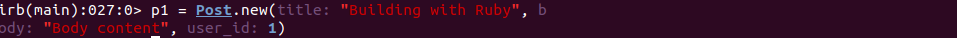

# MICRO-REDDIT
This is a mini clone of the reddit application, which displays the authors/users, comments and their post via the rails associations, it also checks for validation of the inputs field before it is saved into the database. It is tested on the rails console.

## Built With
- Ruby
- Ruby on Rails

## Getting Started
To get a local copy up and running follow these simple example steps:
 
### Prerequisite
- Install rails or checkout the <a href="https://guides.rubyonrails.org/getting_started.html">Rails Guide</a> on how to setup the rails environment
- Code editor
- Git and Github

## Usage
- Clone the project to your local machine
- Run rails console

## Authors
- Okikiola Apelehin
- Prajwal Thapa

👤 **Author1**

- Github: [@okikiola11](https://github.com/okikiola11)
- Twitter: [@Kikiolla3](https://twitter.com/Kikiolla3)
- Linkedin: [@okikiola-apelehin](https://www.linkedin.com/in/okikiola-apelehin-459008122/)

👤 **Author2**
- LinkedIn: [Prazwalthapa](www.linkedin.com/in/prazwal-thapa/) 
- GitHub: [@praz99](https://github.com/praz99)
- E-mail: t.prazwal@gmail.com 

## 🤝 Contributing

Contributions, issues and feature requests are welcome!

Feel free to check the [issues page](https://github.com/okikiola11/micro-reddit/issues).

## Show your support

Give a ⭐️ if you like this project!

## Acknowledgments

- Google

## 📝 License

This project is [MIT](lic.url) licensed.
